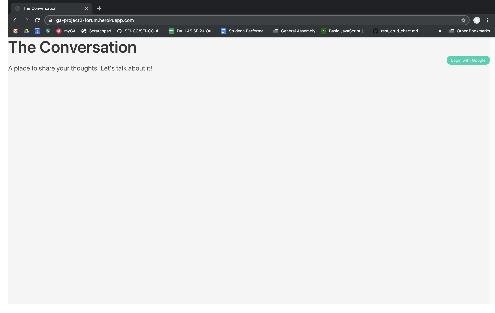
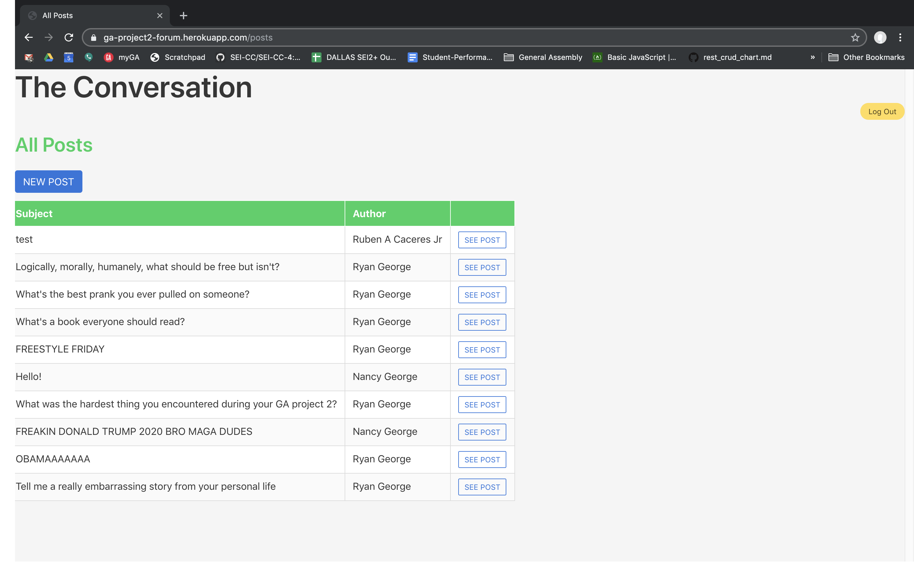
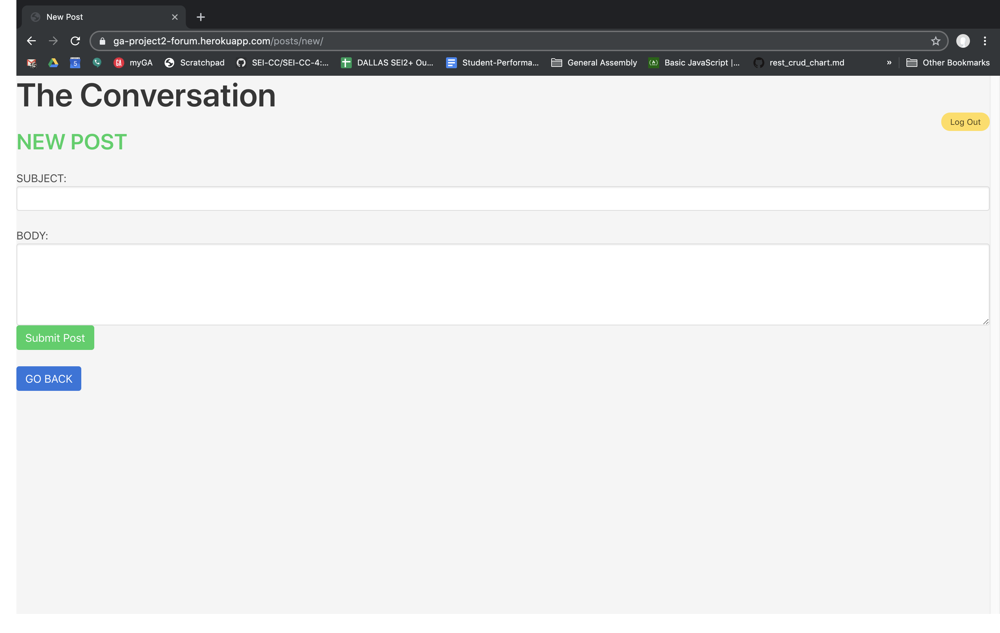
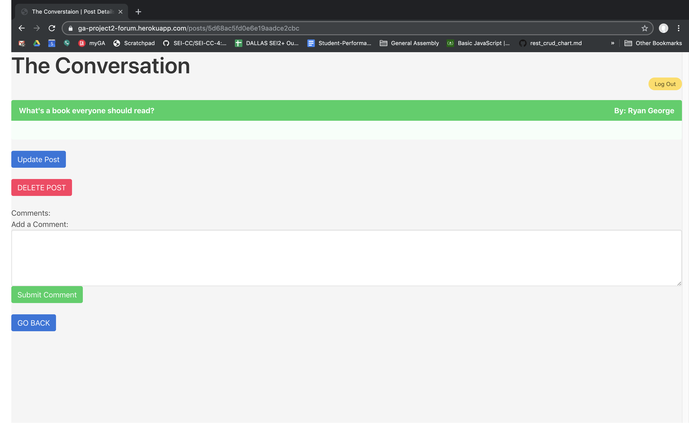
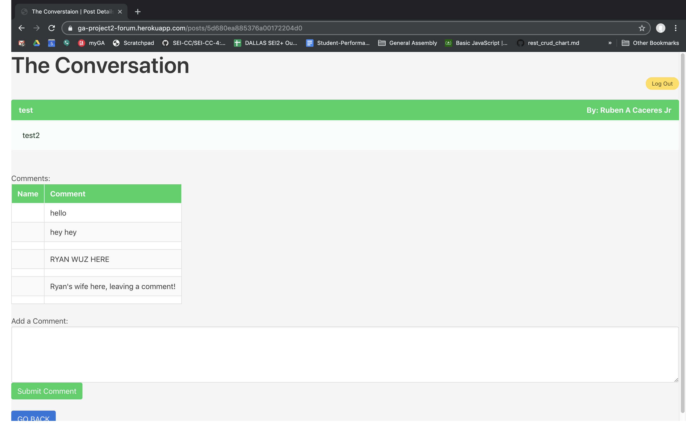

## https://ga-project2-forum.herokuapp.com/

# THE CONVERSATION: A place to share your thoughts.

Do you:
-------
* have a deep philosophical argument you'd like to debate, but all your friends find you insufferable?
* want to discuss that boring book that only you've been reading lately?
* want to share your terrible and inflammatory political or religious views without annoying or offending people in real life?

# WELL THEN LOOK NO FURTHER MAN

When you join The Conversation, you can:
* see all posts from yourself and other users
* create posts that others can discuss.
* update your post or subject: edit your typos or add a second thought to the discussion!
* delete your posts
* comment on your own posts and other people's posts 
  - deleting and editing comments is a feature that will be added in the future.

# 
## Technologies Used:
- JavaScript
- Node.js
- Express.js
- Passport.js
- Mongoose.js
- MongoDB
- Oauth2.0

#
## Getting Started:
1. Simply login with your Google ID. 
2. Join a conversation by clicking SEE POST
3. Add to a conversation by adding a comment! 

#
## Screenshots: 

------
### ICEBOX
------

I'VE GOT THIS **ICEBOX** WHERE MY FEATURES USED TO BE:
> Items I want to add later:
> * edit/update and delete your comments
> * show your name along with your comment
> * the ability to post pictures and embed videos